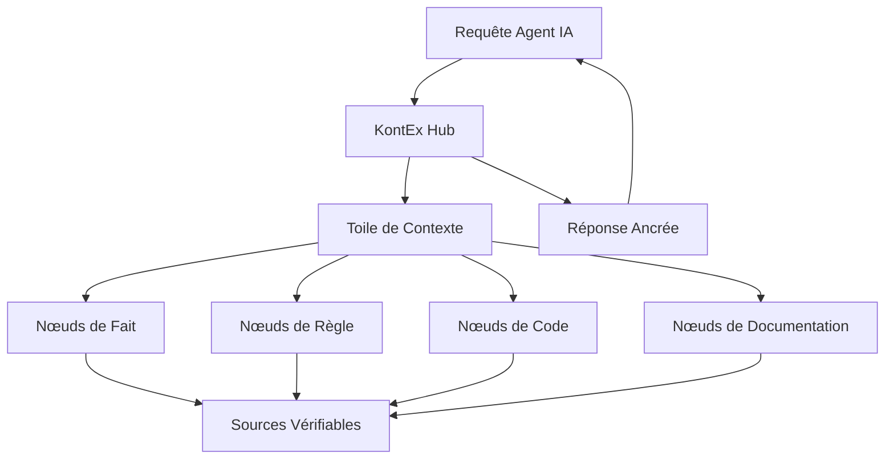

# KontEx — Operating System de Context Engineering (B2B2B)

> **Statut :** Phase 0 — Fondations TTC  
> **Version :** 0.1.0-alpha  
> **Licence :** Propriétaire (Tous droits réservés)  
> **Auteur :** dilevembamu12  
> **Date de cadrage :** 2026-07-30

---

## 1. Vision Produit

KontEx est un **système d'exploitation de Context Engineering** conçu pour le marché **B2B2B** (Business-to-Business-to-Business). Il fournit une couche d'orchestration de contexte permettant aux agents IA (Vibe Coding, LLMs, IDE agents) de travailler **sans hallucination** en s'appuyant sur la **Théorie de la Toile Cosmologique (TTC)**.

### 1.1 Problème résolu

Les LLMs produisent des hallucinations car ils manquent de **contexte ancré**. KontEx résout cela en :
- **Contextualisant** chaque requête dans une toile sémantique persistante
- **Ancrant** les réponses dans des faits vérifiés et traçables
- **Orchestrant** le flux de contexte entre les agents, les APIs et les bases de connaissances

### 1.2 Marché cible (B2B2B)

| Niveau | Cible | Besoin |
|--------|-------|--------|
| **B1** | Éditeurs de plateformes IA / IDE | Intégrer un moteur de contexte anti-hallucination |
| **B2** | Entreprises utilisatrices (DevOps, Engineering) | Fiabiliser leurs workflows de Vibe Coding |
| **B3** | Clients finaux (équipes produit) | Obtenir du code généré sans erreur contextuelle |

---

## 2. Théorie de la Toile Cosmologique (TTC)

### 2.1 Principes Fondamentaux

La TTC postule que tout **contexte** est un nœud dans une toile multidimensionnelle où :

1. **Principe d'Ancrage ($A$)** : Chaque fait doit être relié à au moins une source vérifiable
   $$A(f) \implies \exists s \in Sources : lien(f, s)$$

2. **Principe de Cohérence ($C$)** : Aucune contradiction ne peut exister dans la toile sans résolution explicite
   $$C(n_1, n_2) \implies \neg (n_1 \oplus n_2) \lor résolu(n_1, n_2)$$

3. **Principe de Propagation ($P$)** : Le contexte se propage par liens de pertinence pondérés
   $$P(n_i, n_j) = w_{ij} \cdot relevance(n_i, n_j)$$

4. **Principe d'Entropie Minimale ($E_{min}$)** : La toile tend vers l'état de moindre ambiguïté
   $$E_{min}(T) = \arg\min_{T'} \sum_{n \in T'} ambiguity(n)$$

### 2.2 Structure de la Toile



---

## 3. Architecture Technique

### 3.1 Stack

| Couche | Technologie | Rôle |
|--------|------------|------|
| **Core Engine** | Rust / WebAssembly | Moteur TTC haute performance |
| **API Gateway** | GraphQL + gRPC | Interface unifiée B2B2B |
| **Context Store** | PostgreSQL + pgvector | Stockage vectoriel de la toile |
| **Cache Layer** | Redis | Mise en cache des nœuds fréquents |
| **SDK** | TypeScript, Python, Rust | Intégration IDE/Agent |
| **UI Dashboard** | Next.js + shadcn/ui | Administration de la toile |

### 3.2 Modules Principaux

```
kontex/
├── core/                    # Moteur TTC (Rust)
│   ├── ttc-engine/          # Implémentation des 4 principes TTC
│   ├── context-weaver/      # Tisseur de toile contextuelle
│   └── anchor-verifier/     # Vérificateur d'ancrage
├── api/                     # API Gateway
│   ├── graphql/             # Schema GraphQL
│   └── grpc/                # Services gRPC
├── sdk/                     # SDKs multi-langages
│   ├── typescript/          # SDK VSCode/Cursor
│   ├── python/              # SDK Jupyter/ML
│   └── rust/                # SDK natif
├── dashboard/               # Interface d'administration
├── docs/                    # Documentation TTC
└── examples/                # Cas d'usage B2B2B
```

---

## 4. Roadmap

| Phase | Nom | Livrable Clé | Date Cible |
|-------|-----|-------------|------------|
| **0** | Fondations TTC | Specs théoriques, .cursorrules, cadrage | T0 (2026-07-30) |
| **1** | Core Prototype | Moteur TTC Rust minimal + API | T0 + 6 semaines |
| **2** | SDK VSCode | Extension VSCode/Cursor pour Vibe Coding | T0 + 12 semaines |
| **3** | Dashboard Alpha | UI d'administration de toile | T0 + 18 semaines |
| **4** | B2B2B Beta | Intégration partenaires pilotes | T0 + 24 semaines |
| **5** | GA v1.0 | Lancement commercial | T0 + 36 semaines |

---

## 5. Métriques de Succès (OKR Phase 0 → 1)

- [ ] **O1** : La TTC est formellement spécifiée et publiable
  - [ ] KR1.1 : Les 4 principes TTC ont une définition mathématique complète
  - [ ] KR1.2 : 3 cas d'usage B2B2B documentés avec scénarios avant/après
  - [ ] KR1.3 : Revue par un pair expert en IA symbolique

- [ ] **O2** : Le prototype Core compile et passe les tests de non-régression TTC
  - [ ] KR2.1 : Moteur capable de tisser une toile de 10 000 nœuds en < 100ms
  - [ ] KR2.2 : Taux de détection d'hallucination > 95% sur benchmark interne
  - [ ] KR2.3 : 0 contradiction non résolue dans la toile de test

---

## 6. Conventions de Développement

- **Langue** : Français pour la documentation, Anglais pour le code
- **Commits** : [Conventional Commits](https://www.conventionalcommits.org/)
- **Branching** : GitFlow (main → develop → feature/*)
- **Code Review** : Obligatoire avant merge sur main
- **Tests** : TDD obligatoire sur le moteur TTC

---

*Ce document est le point d'entrée unique de la vision KontEx. Toute décision architecturale doit y faire référence.*
